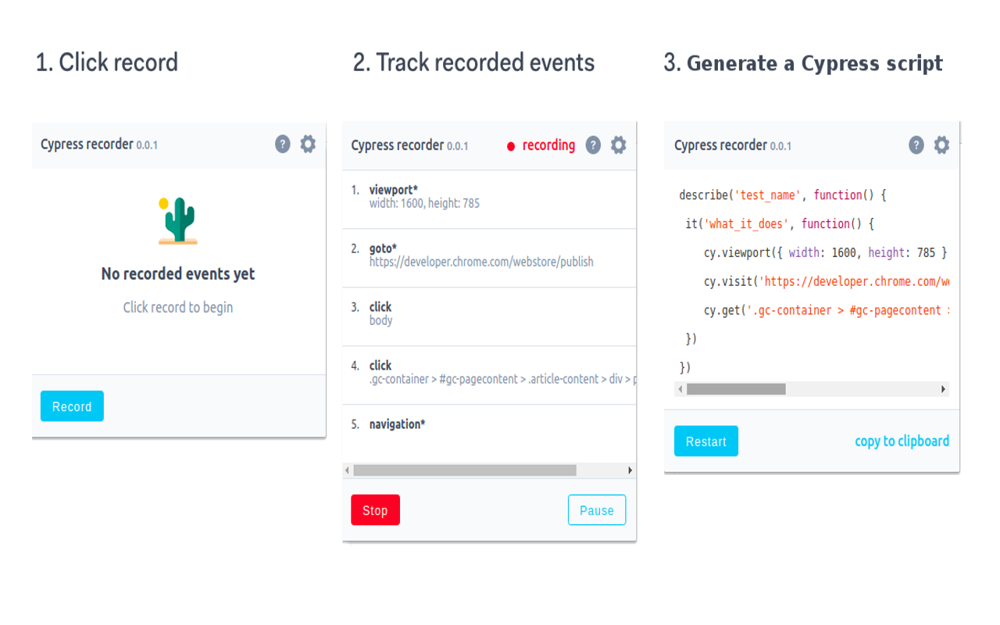

# Cypress Recorder

Cypress recorder is a Chrome extension that records your browser interactions and generates a 
[Cypress-io](https://github.com/cypress-io/cypress) script. Install it from the [Chrome Webstore](https://chrome.google.com/webstore/detail/puppeteer-recorder/djeegiggegleadkkbgopoonhjimgehda).
This project is pretty fresh, but does the following already:

- Records clicks and type events.
- Add setViewPort and other useful clauses. 
- Generates a Cypress script.
- Shows which events are being recorded.
- Copy to clipboard.
- Offers configuration options.
- Allows data-id configuration for element selection.

> Note: we only record clicks etc. on a handful of elements, see the `elements-to-bind-to.js` and `dom-events-to-record.js` files in the code-generator folder for which events. This collection will be expanded in future releases.

## Usage

- Click the icon and hit Record.
- Hit <kbd>tab</kbd> after you finish typing in an `input` element.
- Click links, inputs and other elements.
- Wait for full page load on each navigation. The icon will switch from  to .
- Click Pause when you want to navigate without recording anything. Hit Resume to continue recording. 

## Background

Writing Cypress scripts for scraping, testing and monitoring can be tricky. A recorder / code generator can be helpful,
even if the code isn't perfect. This project builds on other projects (see [disclaimer](#user-content-credits--disclaimer) 
below) but add extensibility, configurability and a smoother UI.

## Development

1. Run: `git clone https://github.com/oscartavarez/cypress-recorder.git`
2. Build the project: `cd cypress-recorder && npm i && npm run dev`
2. Navigate to chrome://extensions
3. Make sure 'Developer mode' is checked
4. Click Load unpacked extension...
5. Browse to cypress-recorder/build and click Select

## Credits & disclaimer

Cypress recorder is a slightly code customization for cypres.io base on the excelent work of 
[Puppeteer recorder](https://github.com/checkly/puppeteer-recorder).

## License
Apache 2
